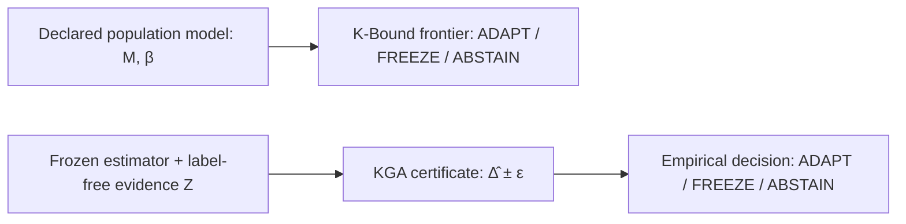

# K-Bound: When Is Label-Free Adaptation Knowable?

[](https://www.python.org/)
[](docs/research/kbound/formal/)
[](docs/research/kbound/)
[](LICENSE)

**K-Bound** introduces a statistical decision layer for Test-Time Adaptation (TTA) under unknown target distribution shifts. It resolves a fundamental safety question in real-world ML deployment: **When target labels are unavailable, should a proposed model update be committed, frozen, or left undecided?**

---

## 📌 Executive Summary

Standard Test-Time Adaptation algorithms (e.g., Tent, EATA, SAR) continuously update model parameters on unlabeled incoming data. However, under severe or unexpected domain shifts, adaptation can **silently degrade model performance**, performing significantly worse than the baseline frozen model.

The repository contains two related but distinct decision rules. They use
different inputs and assumptions; the population rule is not a first stage that
feeds the empirical rule.

1. **K-Bound Theory (Population Frontier)**: Gives a strict-commitment frontier ($|M| > \beta$) over a declared drift class. When $|M| \le \beta$, abstention is the maximal sound three-way action under the stated model.
2. **KGA — Knowability-Guided Adaptation (Empirical Certificate)**: A frozen estimator maps schema-bound, label-free deployment evidence to $\hat{\Delta}$ and a calibrated radius $\varepsilon$. KGA adapts only when $\hat{\Delta} - \varepsilon > 0$. The bound $FA_u \le \alpha$ requires the stated interval-coverage or transfer premise.



---

## ✨ Key Features & Technical Highlights

* 🛡️ **Finite-Sample Error Control**: Bounds the unconditional false-adaptation event ($FA_u \le \alpha$) when the declared one-sided or split-conformal coverage premise holds.
* 📐 **Lean 4 Formal Audit**: The checked algebraic spine contains 65 verified declarations. The audit explicitly lists the measure-theoretic probability foundations that remain outside the mechanized scope.
* ⚡ **Candidate-Adapter Interface**: The decision layer has protocol-specific integrations for **Tent**, **EATA**, and **SAR**; each adapter still requires its own locked configuration, benefit calibration, and validation.
* 📊 **Stress-Grid and Shift Audits**: The repository covers controlled grids and several natural-shift panels. Evidence strength varies by dataset, and iWildCam numerical/action evidence is withheld pending an official-metric rerun; see the table below.

---

## 💻 Installation

```bash
# Clone the repository
git clone https://github.com/Pratikn03/K-Bound.git
cd K-Bound

# Create virtual environment & install dependencies
python3 -m venv .venv
source .venv/bin/activate
pip install -e .
```

---

## 🚀 Quickstart Usage

This synthetic example fits and calibrates the benefit estimator on labelled
development units. At deployment, only schema-bound evidence from model scores
is passed to the frozen estimator; no deployment labels are used.

```python
import hashlib
import numpy as np
from kga import EVIDENCE_FEATURE_NAMES, KGA, fit_frozen_linear_benefit_estimator

rng = np.random.default_rng(0)
kga = KGA(alpha=0.10)
protocol_sha = hashlib.sha256(b"locked-demo-protocol").hexdigest()

# Before deployment: fit and calibrate on separate labelled development units.
x_fit = rng.normal(size=(80, len(EVIDENCE_FEATURE_NAMES)))
y_fit = 0.15 * x_fit[:, 0] - 0.10 * x_fit[:, 1]
x_cal = rng.normal(size=(40, len(EVIDENCE_FEATURE_NAMES)))
y_cal = 0.15 * x_cal[:, 0] - 0.10 * x_cal[:, 1]
estimator = fit_frozen_linear_benefit_estimator(
    x_fit, y_fit, x_cal, y_cal,
    feature_names=EVIDENCE_FEATURE_NAMES,
    evidence_schema_version="kga-generic-score-evidence/1",
    protocol_sha256=protocol_sha,
)

# Deployment: build label-free evidence Z and enforce the locked schema/protocol.
calib_scores = rng.normal(size=(500, 3))
target_scores = rng.normal(size=(500, 3))
kga.evidence(calib_scores, target_scores)
certificate = kga.certify_evidence(estimator, protocol_sha256=protocol_sha)
print(kga.decide(certificate))
```

---

## 📊 Benchmark & Empirical Summary

| Evidence Domain | Benchmark Datasets | KGA Performance & Behavior | Safety Impact |
| :--- | :--- | :--- | :--- |
| **Controlled stress grids** | CIFAR-10-C, ImageNet-C | Tent and EATA have pooled CIFAR-10-C point advantages; SAR does not. Retrospective Holm adjustment over the six prospectively named contrasts gives adjusted Tent p=0.09375; non-confirmatory. | Controlled evidence only; no confirmatory or natural-shift win is claimed. |
| **Prospective natural shift** | CCT-20 | KGA makes 44 FREEZE, 0 ADAPT, and 1 ABSTAIN decisions, tying always-freeze while avoiding harmful adaptation. | Safe-utility/no-harm result; not a bidirectional routing win. |
| **Prospective development gate** | So2Sat-LCZ42 | Adapter selection found no feasible candidate and stopped before gate calibration. The target was never opened, so no target score exists. | Negative development-only evidence; it is separate from the CCT-20 natural-shift result. |
| **Natural diagnostics** | Office-Home, Camelyon17, RxRx1, PACS, ImageNet-R, CIFAR-10.1 | Results are ties, point-only findings, one-sided regimes, or negative diagnostics. iWildCam numbers are withheld pending an official-metric rerun. | No valid natural dataset currently establishes a confidence-supported win over both fixed policies. |

---

## 📂 Repository Layout

```text
.
├── kga/                        Core Python package (KGA certificate, decision policy, assumptions)
├── docs/research/kbound/       Paper source files, figures, submission ledger, & manifests
│   ├── formal/                 Lean 4 machine-checked theorem proofs (65 verified declarations)
│   ├── paper/                  LaTeX manuscript sections & generated numeric tables
│   └── kbound_tmlr.tex         Authoritative TMLR / single-column manuscript driver
├── experiments/kbound/         Execution harnesses, result JSONs, & protocol runners
├── research_lock/              Pre-registered experiment locks & condition matrices
├── scripts/                    Build, verification, and audit automation tools
└── tests/                      Pytest suite for certificate validity and assumption gates
```

---

## 📄 Formal Verification (Lean 4)

K-Bound provides machine-checked proofs for its core theoretical results using **Lean 4**. To audit or build the Lean proofs:

```bash
cd docs/research/kbound/formal
lake build
```

Verification details and foundational limits are documented in [`docs/research/kbound/formal/README.md`](docs/research/kbound/formal/).

---

## 📝 Citation

If you use K-Bound or KGA in your research, please cite our manuscript:

```bibtex
@article{niroula2026kbound,
  title     = {K-Bound: When Is Label-Free Adaptation Knowable?},
  author    = {Niroula, Pratik},
  note      = {Manuscript under review},
  year      = {2026},
  url       = {https://github.com/Pratikn03/K-Bound}
}
```

---

## 📜 License

This project is licensed under the MIT License — see the [LICENSE](LICENSE) file for details.
