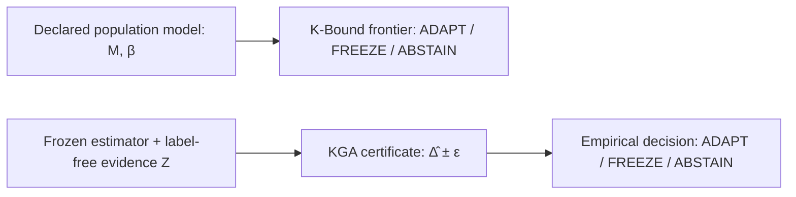

# K-Bound: When Is Label-Free Adaptation Knowable?

[](https://www.python.org/)
[](docs/research/kbound/formal/)
[](docs/research/kbound/)
[](LICENSE)

**K-Bound** studies a decision that comes before committing a test-time adaptation (TTA) update: **When target labels are unavailable, does the available evidence support adaptation, freezing, or abstention?** Its population result is class-dependent; its practical interval rule requires a justified coverage premise.

## Paper and supporting evidence

The [2026-09-22 release](https://github.com/Pratikn03/K-Bound/releases/tag/kbound-2026-09-22)
provides the full and appendix-free PDF/Word manuscripts, the TMLR companion,
source and evidence archives, result JSONs, execution snapshots, verification
records, and SHA-256 inventories. The repository contains the maintained code,
protocols, compact historical records, and
[next-phase evidence manifest](docs/research/kbound/next_phase/evidence_manifest.json).
The release archive supplies the manifest-bound files under `output/next_phase/`,
which are intentionally excluded from normal Git tracking.

Start with the release's README and outer archive receipt. The package verifier
checks archived bytes, including nested source and evidence archives; the
[release checklist](docs/research/kbound/next_phase/RELEASE_CHECKLIST.md) explains
how to repeat the source-bound checks. Download all assets from the same release
and verify their published hashes before combining them. External datasets and
checkpoint tensors are governed by their original distribution terms; acquisition
instructions and recorded identities are provided in [DATA.md](DATA.md).

These records support scoped, reproducible claims. Historical provenance gaps,
poor held-out interval inclusion, stopped natural-shift studies, and conditional
theory assumptions remain explicit in the paper and
[scientific assessment](docs/research/kbound/next_phase/FINAL_ASSESSMENT.md).

---

## 📌 Executive Summary

Standard Test-Time Adaptation algorithms (e.g., Tent, EATA, SAR) continuously update model parameters on unlabeled incoming data. However, under severe or unexpected domain shifts, adaptation can **silently degrade model performance**, performing significantly worse than the baseline frozen model.

The repository contains two related but distinct decision rules. They use
different inputs and assumptions; the population rule is not a first stage that
feeds the empirical rule.

1. **K-Bound Theory (Population Frontier)**: Gives a strict-commitment frontier ($|M| > \beta$) over a declared disagreement-conditional calibration-residual class. The residual $\gamma$ is not automatically distribution drift. When $|M| \le \beta$, abstention is the maximal sound three-way action under the stated rich binary model.
2. **KGA — Knowability-Guided Adaptation (Empirical Certificate)**: A frozen estimator maps schema-bound, label-free deployment evidence to a predicted evaluation-cell benefit $\hat{\Delta}$ and a residual radius $\varepsilon$. KGA adapts only when $\hat{\Delta} - \varepsilon > 0$. The bound $FA_u \le \alpha$ concerns the scalar target covered by that interval; coverage of an observed cell outcome does not automatically cover population benefit or repeated deployment.



---

## ✨ Key Features & Technical Highlights

* 🛡️ **Finite-Sample Error Control**: Bounds the unconditional false-adaptation event ($FA_u \le \alpha$) when the declared one-sided or split-conformal coverage premise holds.
* 📐 **Lean 4 Formal Audit**: 150 registered checks comprise 70 legacy checks and 80 foundation capstones under explicit assumptions. The unrestricted historical one-bit/H extension remains outside the verified scope. This count is not the number of paper theorems or every authored Lean declaration.
* ⚡ **Candidate-Adapter Interface**: The decision layer has protocol-specific integrations for **Tent**, **EATA**, and **SAR**; each adapter still requires its own locked configuration, benefit calibration, and validation.
* 📊 **Stress-Grid and Shift Audits**: The repository covers controlled grids and several natural-shift panels. Evidence strength varies by dataset, and iWildCam numerical/action evidence is withheld pending an official-metric rerun; see the table below.

---

## 💻 Installation

```bash
# Clone the repository
git clone https://github.com/Pratikn03/K-Bound.git
cd K-Bound

# Create virtual environment & install dependencies
python3 -m venv .venv
source .venv/bin/activate
pip install -e .
```

---

## 🚀 Quickstart Usage

This synthetic example fits and calibrates the benefit estimator on labelled
development units. At deployment, only schema-bound evidence from model scores
is passed to the frozen estimator; no deployment labels are used.
It demonstrates the software interface, not a transfer-coverage result.

```python
import hashlib
import numpy as np
from kga import EVIDENCE_FEATURE_NAMES, KGA, fit_frozen_linear_benefit_estimator

rng = np.random.default_rng(0)
kga = KGA(alpha=0.10)
protocol_sha = hashlib.sha256(b"locked-demo-protocol").hexdigest()

# Before deployment: fit and calibrate on separate labelled development units.
x_fit = rng.normal(size=(80, len(EVIDENCE_FEATURE_NAMES)))
y_fit = 0.15 * x_fit[:, 0] - 0.10 * x_fit[:, 1]
x_cal = rng.normal(size=(40, len(EVIDENCE_FEATURE_NAMES)))
y_cal = 0.15 * x_cal[:, 0] - 0.10 * x_cal[:, 1]
estimator = fit_frozen_linear_benefit_estimator(
    x_fit, y_fit, x_cal, y_cal,
    feature_names=EVIDENCE_FEATURE_NAMES,
    evidence_schema_version="kga-generic-score-evidence/1",
    protocol_sha256=protocol_sha,
)

# Deployment: build label-free evidence Z and enforce the locked schema/protocol.
calib_scores = rng.normal(size=(500, 3))
target_scores = rng.normal(size=(500, 3))
kga.evidence(calib_scores, target_scores)
certificate = kga.certify_evidence(estimator, protocol_sha256=protocol_sha)
print(kga.decide(certificate))
```

Unavailable evidence is not a certified FREEZE. The maintained service records
ABSTAIN and retains the frozen predictor when no usable benefit interval exists;
the low-level package raises explicit validation errors and invalidates cached
authority. Malformed HTTP requests are rejected before a decision is assessed.
The score-only HTTP `proxy` mode is diagnostic and produces no benefit certificate;
`full` mode is a paired-benefit or external-estimate audit, not a label-free
deployment estimator.

The installed package and CLI are `kga` (see the explicit package include list in
`pyproject.toml`). The older `docs/research/kbound/kbound_pkg/kbound` prototype is
retained for historical reproduction, not for certified deployment. In particular,
its heuristic gate and gradient-scaling optimizer do not implement the maintained
ABSTAIN/retain-frozen contract. Do not treat their legacy action strings as
certified decisions or use them as the deployment quickstart.

Research runners have a separate boundary. CCT-20 records ABSTAIN for unavailable
live features and rejects invalid sealed artifacts. The So2Sat v1 runner aborts
an incomplete bundle; it does not provide the public service's operational
ABSTAIN/frozen-return response. Its target execution remains disabled because
the protocol and runner disagree on the action unit. Neither an exception nor
that disabled runner is a certified FREEZE or a completed target experiment.

---

## 📊 Benchmark & Empirical Summary

| Evidence Domain | Benchmark Datasets | KGA Performance & Behavior | Safety Impact |
| :--- | :--- | :--- | :--- |
| **Controlled stress grids** | CIFAR-10-C, ImageNet-C | Tent and EATA have pooled CIFAR-10-C point advantages; SAR does not. Retrospective Holm adjustment over the six prospectively named contrasts gives adjusted Tent p=0.09375; non-confirmatory. | Controlled evidence only; no confirmatory or natural-shift win is claimed. |
| **Prospective natural shift** | CCT-20 | KGA makes 44 FREEZE, 0 ADAPT, and 1 ABSTAIN decisions, tying always-freeze while avoiding the measured degradation from always-adapt. | Passes the locked safe-utility check at its nominal bootstrap level; not a population-safety guarantee or bidirectional routing result. |
| **Prospective development gate (v1)** | So2Sat-LCZ42 | Adapter selection found no feasible candidate and stopped before gate calibration. The target was never opened, so no target score exists. | Preserved negative development-only evidence. |
| **Locked calibration gate (v2)** | So2Sat-LCZ42 | All 19 cities × 5 checkpoints completed: 2 ADAPT, 0 direct FREEZE and 93 ABSTAIN. Only one city supplied ADAPT and none supplied FREEZE, failing the fixed seven-city requirements. Target remains unopened. | Two helpful accepted calibration updates do not establish target routing value; the calibration utilities are descriptive. |
| **Natural diagnostics** | Office-Home, Camelyon17, RxRx1, PACS, ImageNet-R, CIFAR-10.1 | Results are ties, point-only findings, one-sided regimes, or negative diagnostics. iWildCam numbers are withheld pending an official-metric rerun. | No valid natural dataset currently establishes a confidence-supported win over both fixed policies. |

---

## Next-phase research revision — 2026-09-21

The [next-phase evidence reports](docs/research/kbound/next_phase/) add a retrospective shared-predictor calibration comparison, an assumption-explicit paired-transport certificate and synthetic diagnostic, a newly locked So2Sat v2 execution, and measured local deployment costs. The new calibration comparison does not establish general superiority to simple margins; the transport diagnostic retains harmful assumption-violating counterexamples. Historical B6 remains descriptive.

The local production-mode certificate API and the separately tested request lifecycle do not establish neural adaptation deployment or field utility. The lifecycle now enforces calibration expiry, identity binding, durable-journal failure handling and bounded receipt/journal retention. Its statistical assumptions remain separate from these engineering controls. See the [deployment report](docs/research/kbound/next_phase/deployment_results.md) and [release checklist](docs/research/kbound/next_phase/RELEASE_CHECKLIST.md) for exact scope and current artifacts. Physical-device camera work remains deferred until after publication.

## 📂 Repository Layout

```text
.
├── kga/                        Core Python package (KGA certificate, decision policy, assumptions)
├── docs/research/kbound/       Paper source files, figures, submission ledger, & manifests
│   ├── formal/                 Lean 4 proofs and explicit declaration-scope audit
│   ├── paper/                  LaTeX manuscript sections & generated numeric tables
│   └── kbound_tmlr.tex         Authoritative TMLR / single-column manuscript driver
├── experiments/kbound/         Execution harnesses, result JSONs, & protocol runners
├── research_lock/              Pre-registered experiment locks & condition matrices
├── scripts/                    Build, verification, and audit automation tools
└── tests/                      Pytest suite for certificate validity and assumption gates
```

---

## 📄 Formal Verification (Lean 4)

K-Bound provides machine-checked proofs for its core theoretical results using **Lean 4**. To audit or build the Lean proofs:

```bash
cd docs/research/kbound/formal
bash build.sh
```

Verification details and foundational limits are documented in [`docs/research/kbound/formal/README.md`](docs/research/kbound/formal/).
The 2026-08-31 kernel build and transitive-axiom audit pass for the registered
scope. New modules prove exchangeable residual coverage, filtered Ville/betting,
general KL/TV finite-product testing, bounded concentration, and a measurable
correctness-field frontier. The full-foundations gate still fails for the
historical one-bit/H/ratio-rate extension: orbit selection alone is insufficient.
No formal result certifies empirical preprocessing or calibration transfer.
Current revision checks and remaining release blockers are recorded in
[`THEOREM_NOVELTY_BIBLIOGRAPHY_REVIEW.md`](docs/research/kbound/audits/THEOREM_NOVELTY_BIBLIOGRAPHY_REVIEW.md).

---

## 📝 Citation

If you use K-Bound or KGA in your research, please cite our manuscript:

```bibtex
@article{niroula2026kbound,
  title     = {K-Bound: When Is Label-Free Adaptation Knowable?},
  author    = {Niroula, Pratik},
  note      = {Research manuscript},
  year      = {2026},
  url       = {https://github.com/Pratikn03/K-Bound}
}
```

---

## 📜 License

This project is licensed under the MIT License — see the [LICENSE](LICENSE) file for details.
