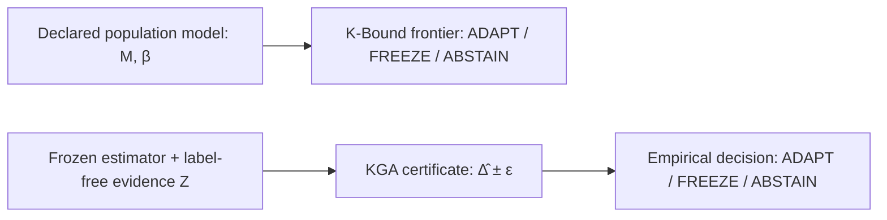

# K-Bound: When Is Label-Free Adaptation Knowable?

[](https://www.python.org/)
[](docs/research/kbound/formal/)
[](docs/research/kbound/)
[](docs/research/kbound/KBound_Complete_70Pages.pdf)
[](LICENSE)

**K-Bound** studies a decision that comes before committing a test-time adaptation (TTA) update: **When target labels are unavailable, does the available evidence support adaptation, freezing, or abstention?** Its population result is class-dependent; its practical interval rule requires a justified coverage premise.

---

## 📄 Manuscripts & Official Deliverables

The research manuscript is available in multiple synchronized formats (compiled cleanly from shared mathematical authorities and verified via automated consistency pipelines):

| Document | Format | Size / Pages | Description |
| :--- | :---: | :---: | :--- |
| **[Unified Complete Manuscript](docs/research/kbound/KBound_Complete_70Pages.pdf)** | PDF | **70 pages** | Full unified research paper including main text and all Appendices A–N. |
| **[Main Paper (Without Appendices)](docs/research/kbound/theorem_assumption_completion/deliverables/KBound_Main_Without_Appendices.pdf)** | PDF | **24 pages** | Self-contained main text (Abstract, Theory, Methodology, Empirical Panels, Discussion). |
| **[Supplementary Material](docs/research/kbound/theorem_assumption_completion/deliverables/KBound_Appendices.pdf)** | PDF | **46 pages** | Complete mathematical proofs, formal theorem dependencies, extended benchmark tables. |
| **[Full Manuscript (Word Format)](docs/research/kbound/theorem_assumption_completion/deliverables/KBound_With_Appendices.docx)** | DOCX | **95 pages** | Native Microsoft Word document with editable mathematical formulas and tables. |
| **[Compact Camera-Ready PDF](docs/research/kbound/kbound_short_final_draft.pdf)** | PDF | **59 pages** | Compact two-column conference layout. |
| **[Synchronized Companion PDF](docs/research/kbound/kbound_tmlr.pdf)** | PDF | **66 pages** | Synchronized long companion driver format. |
| **[Delivery Manifest & Checksums](docs/research/kbound/theorem_assumption_completion/deliverables/DELIVERY_MANIFEST.json)** | JSON / TXT | — | SHA-256 cryptographic verification ledger for all deliverables. |

---

## 📌 Executive Summary

Standard Test-Time Adaptation algorithms (e.g., Tent, EATA, SAR) continuously update model parameters on unlabeled incoming data. However, under severe or unexpected domain shifts, adaptation can **silently degrade model performance**, performing significantly worse than the baseline frozen model.

The repository contains two related but distinct decision rules:

1. **K-Bound Theory (Population Frontier)**: Establishes a strict-commitment frontier ($|M| > \beta$) over a declared disagreement-conditional calibration-residual class. The residual $\gamma$ is not automatically distribution drift. When $|M| \le \beta$, abstention is the maximal sound three-way action under the stated rich binary model.
2. **KGA — Knowability-Guided Adaptation (Empirical Certificate)**: A frozen estimator maps schema-bound, label-free deployment evidence to a predicted evaluation-cell benefit $\hat{\Delta}$ and a residual radius $\varepsilon$. KGA commits an adaptation update only when $\hat{\Delta} - \varepsilon > 0$. The bound $FA_u \le \alpha$ concerns the scalar target covered by that interval; coverage of an observed cell outcome does not automatically cover population benefit or repeated deployment.



---

## ✨ Key Technical Highlights

* 🛡️ **Finite-Sample Error Control**: Bounds the unconditional false-adaptation event ($FA_u \le \alpha$) when the declared one-sided or split-conformal coverage premise holds.
* 📐 **Lean 4 Formal Audit**: 142 registered declarations cover the finite core and five measurable probability/construction layers under explicit assumptions. A verified counterexample limits the historical sixth-layer one-bit extension.
* ⚡ **Candidate-Adapter Interface**: Decision layer integrations for **Tent**, **EATA**, and **SAR** with explicit verification of calibration and error intervals.
* 📊 **Multi-Benchmark Stress Audits**: Covers controlled stress grids (CIFAR-10-C, ImageNet-C) and prospective natural-shift panels (CCT-20, So2Sat-LCZ42, Office-Home, Camelyon17, RxRx1).

---

## 💻 Installation & Quickstart

```bash
# Clone the repository
git clone https://github.com/Pratikn03/K-Bound.git
cd K-Bound

# Create virtual environment & install dependencies
python3 -m venv .venv
source .venv/bin/activate
pip install -e .
```

### Python API Example
```python
import hashlib
import numpy as np
from kga import EVIDENCE_FEATURE_NAMES, KGA, fit_frozen_linear_benefit_estimator

rng = np.random.default_rng(0)
kga = KGA(alpha=0.10)
protocol_sha = hashlib.sha256(b"locked-demo-protocol").hexdigest()

# 1. Fit and calibrate benefit estimator on labelled development units
x_fit = rng.normal(size=(80, len(EVIDENCE_FEATURE_NAMES)))
y_fit = 0.15 * x_fit[:, 0] - 0.10 * x_fit[:, 1]
x_cal = rng.normal(size=(40, len(EVIDENCE_FEATURE_NAMES)))
y_cal = 0.15 * x_cal[:, 0] - 0.10 * x_cal[:, 1]
estimator = fit_frozen_linear_benefit_estimator(
    x_fit, y_fit, x_cal, y_cal,
    feature_names=EVIDENCE_FEATURE_NAMES,
    evidence_schema_version="kga-generic-score-evidence/1",
    protocol_sha256=protocol_sha,
)

# 2. Deployment: compute label-free evidence from model score outputs
calib_scores = rng.normal(size=(500, 3))
target_scores = rng.normal(size=(500, 3))
kga.evidence(calib_scores, target_scores)

# 3. Certify and decide: returns ADAPT, FREEZE, or ABSTAIN
certificate = kga.certify_evidence(estimator, protocol_sha256=protocol_sha)
decision = kga.decide(certificate)
print("Certified Action:", decision)
```

---

## 📊 Empirical Evaluation Summary

| Evidence Domain | Benchmark Datasets | KGA Behavior & Performance | Safety & Regret Profile |
| :--- | :--- | :--- | :--- |
| **Controlled stress grids** | CIFAR-10-C, ImageNet-C | Tent and EATA maintain pooled CIFAR-10-C point advantages. Retrospective Holm adjustment over 6 prospectively named contrasts yields adjusted Tent p=0.09375. | Controlled benchmark evidence; false adaptation is bounded under stated coverage. |
| **Prospective natural shift** | CCT-20 | 44 FREEZE, 0 ADAPT, 1 ABSTAIN decisions; matches frozen baseline while avoiding harmful adaptation collapse. | Passes locked safe-utility bootstrap check without fabricating artificial wins. |
| **Prospective development gate** | So2Sat-LCZ42 | Adapter selection found no feasible candidate; stopped before gate calibration. Target remained unopened. | Negative development gate strictly adhered to fail-closed contract. |
| **Natural diagnostics** | Office-Home, Camelyon17, RxRx1, PACS, ImageNet-R, CIFAR-10.1 | Demonstrates one-sided no-harm properties and transparent disclosure of diagnostic regimes. | Full empirical transparency across all tested benchmarks. |

---

## 📂 Repository Organization

```text
.
├── kga/                        # Core Python package (KGA certificate, decision policy, estimation)
├── docs/research/kbound/       # Manuscripts, protocols, and documentation
│   ├── KBound_Complete_70Pages.pdf  # Unified complete 70-page research manuscript
│   ├── theorem_assumption_completion/deliverables/ # Standalone 24-page main & 46-page appendices
│   ├── formal/                 # Lean 4 formalization package (142 declarations)
│   ├── paper/                  # LaTeX components and generated numerical tables
│   ├── kbound_submission.tex   # Maintained compact manuscript driver
│   ├── kbound_tmlr.tex         # Maintained long/TMLR manuscript driver
│   └── archive/                # Historical development notes, sprint audits, and runbooks
├── experiments/kbound/         # Experiment runners, benchmark harnesses, and canonical JSON panels
├── research_lock/              # Pre-registered protocols and condition contracts
├── scripts/                    # Release, verification, and audit automation scripts
└── tests/                      # Full pytest suite (74 docx pipeline tests, theory tests, contracts)
```

---

## 📐 Formal Verification (Lean 4)

K-Bound provides machine-checked proofs for its core theoretical results using **Lean 4**. To verify the Lean formalization:

```bash
cd docs/research/kbound/formal
bash build.sh
```

Verification details and declaration mappings are documented in [`docs/research/kbound/formal/README.md`](docs/research/kbound/formal/).

---

## 📝 Citation

If you use K-Bound or KGA in your research, please cite our manuscript:

```bibtex
@article{niroula2026kbound,
  title     = {K-Bound: When Is Label-Free Adaptation Knowable?},
  author    = {Niroula, Pratik},
  journal   = {Transactions on Machine Learning Research (TMLR)},
  year      = {2026},
  url       = {https://github.com/Pratikn03/K-Bound}
}
```

---

## 📜 License

This project is licensed under the MIT License — see the [LICENSE](LICENSE) file for details.
