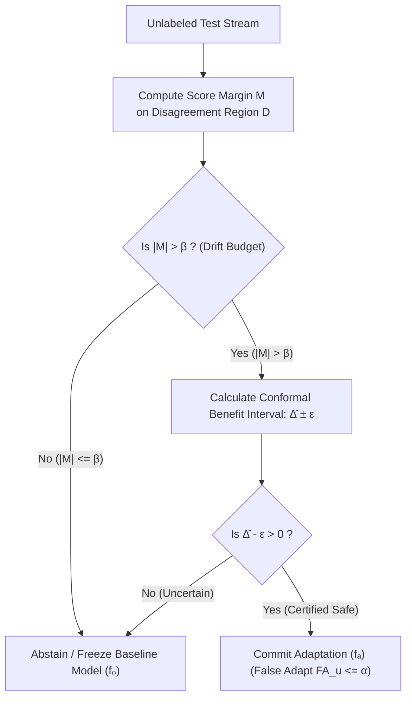

# K-Bound & KGA: Knowability-Guided Adaptation for Safe Test-Time Adaptation

[](https://www.python.org/)
[](docs/research/kbound/formal/)
[](docs/research/kbound/)
[](LICENSE)

**K-Bound** introduces a statistical decision layer for Test-Time Adaptation (TTA) under unknown target distribution shifts. It resolves a fundamental safety question in real-world ML deployment: **When target labels are unavailable, should a proposed model update be committed, frozen, or left undecided?**

---

## 📌 Executive Summary

Standard Test-Time Adaptation algorithms (e.g., Tent, EATA, SAR) continuously update model parameters on unlabeled incoming data. However, under severe or unexpected domain shifts, adaptation can **silently degrade model performance**, performing significantly worse than the baseline frozen model.

The framework provides a complete two-layer solution:

1. **K-Bound Theory (Population Frontier)**: Proves the exact minimax impossibility frontier ($|M| > \beta$). It proves that deciding whether to adapt label-freely is mathematically impossible without an externally declared calibration drift budget $\beta$. When score margin $|M| \le \beta$, **abstention (freezing the baseline model)** is the unique sound action.
2. **KGA — Knowability-Guided Adaptation (Empirical Certificate)**: A finite-sample split-conformal safety wrapper. KGA estimates the adaptation benefit $\hat{\Delta}$ from label-free evidence, computes a conformal radius $\varepsilon$, and commits to adaptation **only when $\hat{\Delta} - \varepsilon > 0$**, guaranteeing an unconditional false-adaptation rate **$FA_u \le \alpha$**.



---

## ✨ Key Features & Technical Highlights

* 🛡️ **Guaranteed Safety Bounds**: Mathematically bounds the false-adaptation rate ($FA_u \le \alpha$), preventing catastrophic performance degradation on shifting streams.
* 📐 **Lean 4 Machine-Checked Formalization**: Core statistical learning theorems, Le Cam bounds, and exchangeable-score reductions are verified in **Lean 4** (`formal/` directory with 53 checked theorems).
* ⚡ **Universal Adapter Compatibility**: Plugs seamlessly into existing test-time adaptation methods, including **Tent**, **EATA**, and **SAR**.
* 📊 **Comprehensive Stress Grid & Benchmark Suite**: Evaluated across synthetic stress grids ($432 \times 5$ grid on CIFAR-10-C, ImageNet-C) and real-world distribution shifts (**Camelyon17, iWildCam, Office-Home, RxRx1, PACS, ImageNet-R**).

---

## 💻 Installation

```bash
# Clone the repository
git clone https://github.com/Pratikn03/K-Bound.git
cd K-Bound

# Create virtual environment & install dependencies
python3 -m venv .venv
source .venv/bin/activate
pip install -e .
```

---

## 🚀 Quickstart Usage

KGA wraps any candidate adaptation strategy to generate calibrated decision certificates before applying updates:

```python
import numpy as np
from kga.certificate import conformal_radius, decide

# 1. Collect calibration residuals from out-of-fold development cells
residuals = np.abs(np.random.default_rng(42).normal(loc=0.0, scale=0.03, size=200))

# 2. Compute exact split-conformal radius at target significance level alpha=0.10
epsilon = conformal_radius(residuals, alpha=0.10)

# 3. Evaluate adaptation decision on incoming target batch
print(decide(Bhat=0.12, eps=epsilon))   # Returns 'adapt'   (Benefit > radius)
print(decide(Bhat=-0.08, eps=epsilon))  # Returns 'freeze'  (Benefit < -radius)
print(decide(Bhat=0.01, eps=epsilon))   # Returns 'abstain' (Uncertain / within radius)
```

---

## 📊 Benchmark & Empirical Summary

| Evidence Domain | Benchmark Datasets | KGA Performance & Behavior | Safety Impact |
| :--- | :--- | :--- | :--- |
| **Synthetic Stress Grids** | CIFAR-10-C ($432 \times 5$), ImageNet-C (SAR, Tent, EATA) | **Beats Both** (Outperforms both Always-Adapt and Always-Freeze) | **$FA_u = 0$** across thousands of cells; cuts regret up to **$5.0\times$** vs fixed policies. |
| **Decision-Gate Comparison** | Gate Baseline Panel ($n=432$) | **$0.898$ coverage**, $FA_u = 0$ with radius $\varepsilon$ | Un-certificated score gates suffer high false-adaptation rates ($FA_u = 0.049 \to 0.141$). |
| **One-Sided Natural Shifts** | Camelyon17, iWildCam, Office-Home, RxRx1 | **Certified No-Harm** | Guarantees safety on baseline-dominated tracks, matching the safer fixed policy. |

---

## 📂 Repository Layout

```text
.
├── kga/                        Core Python package (KGA certificate, decision policy, assumptions)
├── docs/research/kbound/       Paper source files, figures, submission ledger, & manifests
│   ├── formal/                 Lean 4 machine-checked theorem proofs (53 verified checks)
│   ├── paper/                  LaTeX manuscript sections & generated numeric tables
│   └── kbound_tmlr.tex         Authoritative TMLR / single-column manuscript driver
├── experiments/kbound/         Execution harnesses, result JSONs, & protocol runners
├── research_lock/              Pre-registered experiment locks & condition matrices
├── scripts/                    Build, verification, and audit automation tools
└── tests/                      Pytest suite for certificate validity and assumption gates
```

---

## 📄 Formal Verification (Lean 4)

K-Bound provides machine-checked proofs for its core theoretical results using **Lean 4**. To audit or build the Lean proofs:

```bash
cd docs/research/kbound/formal
lake build
```

Verification details and foundational limits are documented in [`docs/research/kbound/formal/README.md`](docs/research/kbound/formal/).

---

## 📝 Citation

If you use K-Bound or KGA in your research, please cite our manuscript:

```bibtex
@article{niroula2026kbound,
  title     = {K-Bound: Deciding Whether to Adapt at Test-Time under Calibration Drift Budgets},
  author    = {Niroula, Pratik},
  journal   = {Transactions on Machine Learning Research (TMLR)},
  year      = {2026},
  url       = {https://github.com/Pratikn03/K-Bound}
}
```

---

## 📜 License

This project is licensed under the MIT License — see the [LICENSE](LICENSE) file for details.
