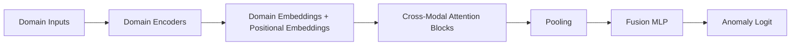

# Attention Fusion Architecture

## Components

1. Domain encoders: map per-domain inputs (score, confidence, embeddings) to a shared embed_dim.
2. Domain embeddings: learned vectors that capture modality identity.
3. Cross-modal attention blocks: multi-head self-attention over domains with masking.
4. Fusion MLP: maps fused representation to a final anomaly logit.

## Data flow

1. Build per-sample tensors: [batch, num_domains, input_dim].
2. Encode each domain to [batch, num_domains, embed_dim].
3. Add learned domain embeddings and apply self-attention blocks.
4. Pool across domains and score with the fusion MLP.

## Missing modalities

- Use key_padding_mask to ignore missing domains.
- Apply domain dropout during training to improve robustness.
