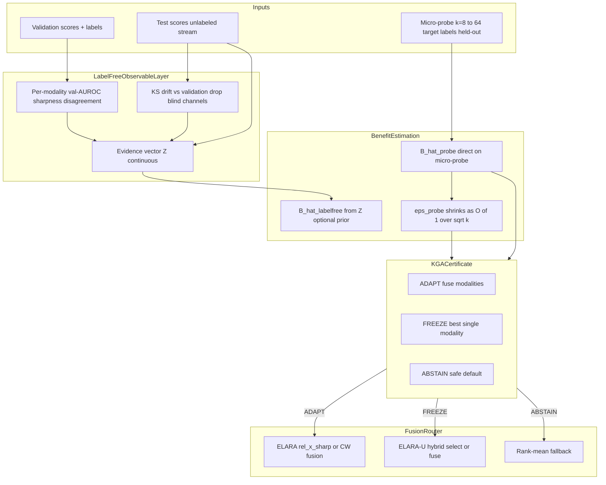

# Target-Label-Light Multimodal Safety Guard

**Status:** Forward blueprint for the K-Bound paper update  
**Date locked:** 2026-06-15  
**Protocol:** [`research_lock/TARGET_LABEL_LIGHT_PROBE_PROTOCOL_v1.yaml`](../../research_lock/TARGET_LABEL_LIGHT_PROBE_PROTOCOL_v1.yaml)

---

## 1. Motivation

K-Bound reframes test-time adaptation as a **decision under identifiability constraints**: adapt when benefit is certifiable, freeze when harm is certifiable, abstain when unlabeled evidence cannot tell. The paper proves this trichotomy is not optional — it is forced by information theory and finite-sample geometry.

Synthesizing the impossibility theorems, bias-limited certifiability, and empirical roadblocks yields one actionable conclusion:

> **Do not build a better adaptation algorithm. Build a safety guard on systems where harm is structurally detectable, using a tiny labeled probe to escape the label-free brick wall.**

### What the negatives teach us

| Finding | Source | Implication |
|---|---|---|
| Unconditional label-free sign-of-benefit is impossible | Prop. impossibility, `kbound.tex` | Abstain is mandatory on the low-margin band |
| Camelyon17 radius is **bias-limited**, not sample-limited | `experiments/kbound/results/camelyon17_fullscale_B_v1/bias_variance_diag/DIAG_FINDINGS.md` | More unlabeled data cannot close the certificate |
| Single-image TTA rarely flips helpful↔harmful detectably on real shift | Limitations §(2), `kbound.tex` | Apply guard to **fusion routers**, not lone classifiers |
| Multimodal KGA already shows all three actions | Table `tab:multimodal`, `results_kga_elara.json` | Architecture is partially validated |

The Camelyon17 bias–variance diagnostic is the pivot: observed conformal radius `eps_256 = 0.112` vs measurement floor `0.044` (ratio 2.55×); only ~16% of residual variance is binomial noise. Quadrupling `n_eval` to 1024 did not halve the radius. The open problem is **calibration-drift bias in B̂(Z)**, not sample size.

---

## 2. Core insight

**Pure label-free adaptation hits an information-theoretic floor.** Fighting that theorem is the wrong move.

The winning operating point steps **slightly** outside label-free:

1. **Micro-probe (8–64 target labels)** — a one-time, held-out calibration draw at deployment removes the calibration-drift bias that caps real-shift certifiability.
2. **Multimodal fusion router** — real harm appears when one sensor goes blind (LiDAR in rain, depth occlusion, failed RGB channel). The certificate guards the **router**, not a single classifier.

This is **target-label-light** — a distinct regime from the label-free core, not a retreat from the impossibility result.

---

## 3. Architecture

### 3.1 System diagram



### 3.2 Decision semantics

| Action | Condition | Deployment behavior |
|---|---|---|
| **ADAPT** | `LB = B̂_probe − ε_probe > 0` | Deploy fused score (`rel_x_sharp` or reliability-gated CW) |
| **FREEZE** | `UB = B̂_probe + ε_probe < 0` | Drop failed modality; use best validation single expert |
| **ABSTAIN** | Bracket contains zero | Rank-mean fallback or human review |

**"Drop"** is FREEZE with an explicit channel mask from the drift guard — not a fourth action.

### 3.3 Code mapping

| Layer | Module | Role |
|---|---|---|
| Observable Z | `kga/evidence.py`, `src/uais/elara_u/router.py` | Label-free drift and reliability features |
| Drift / drop | `router.py` KS guard | Pre-fusion channel mask |
| Fusion | `kga_elara_demo.py`, `src/uais/kbound/multimodal_guard.py` | CW / reliability-gated fusion |
| Certificate | `kga/kga.py` `certify_probe()` | Probe-backed benefit bracket |
| Frozen protocols | `research_lock/REALIAD_D3_NATDEG_HELDOUT_PROTOCOL_v1.yaml`, `MULTIMODAL_RELIABILITY_PROTOCOL_v1.yaml` | Validation-only reliability, held-out confirmation |

---

## 4. Mathematics

### 4.1 Label-free failure mode

Label-free benefit estimator:

```
B̂_label-free = g(Z)
```

Residual decomposition (Camelyon17):

```
|B̂(Z) − B| ≈ γ + σ_meas(n)
```

where `γ` is calibration-drift bias (does **not** shrink with `n`) and `σ_meas(n) = O(1/√n)` is binomial measurement noise. On Camelyon17, `γ` dominates: observed `eps_256 / eps_meas(256) ≈ 2.55`.

### 4.2 Probe estimator

On held-out probe set `P` of size `k`, drawn once at deployment:

```
B̂_probe = (1/k) Σ_{i∈P} [ ℓ(f₀(xᵢ), yᵢ) − ℓ(fₐ(xᵢ), yᵢ) ]
```

For AUROC routing (anomaly scores), use **placement benefits**: per-positive placement minus frozen placement; mean equals AUROC improvement (Mann–Whitney decomposition). Implemented in `placement_benefits()` in `multimodal_guard.py`.

Certificate at fixed `α = 0.10`:

```
LB = B̂_probe − ε_probe(k)
UB = B̂_probe + ε_probe(k)
ADAPT  if LB > 0
FREEZE if UB < 0
else ABSTAIN
```

`ε_probe(k)` uses empirical-Bernstein (`kga.certificate.empirical_bernstein`) on the `k` probe points; variance term scales as `O(1/√k)`.

### 4.3 Operating-point separation (Proposition)

**Proposition (target-label-light escape).** Prop. impossibility (`thm:imp-quant`) applies to measurable maps of label-free evidence `Z` alone. A certificate that observes a fixed-size target-labeled probe `P` with `|P| = k ≥ 1` is **not** subject to that impossibility: the probe provides direct information about `B` on the disagreement region, removing the calibration-drift bias term `γ` that caps label-free certifiability. The residual uncertainty is `O(1/√k)` measurement variance, not irreducible model bias.

**Honest limit:** Probe labels must be held-out and pre-registered. Tuning `k` or probe composition on test forfeits external-validation role (same discipline as frozen `τ*` on Camelyon17).

### 4.4 Relationship to Protocol F

[`RICH_EVIDENCE_CAMELYON_PROTOCOL_F_v1.yaml`](../../research_lock/RICH_EVIDENCE_CAMELYON_PROTOCOL_F_v1.yaml) pursues richer `Z` + PPI debias **without** target labels. The micro-probe is the **primary** lever — simpler, directly attacks bias. Protocol F remains a label-free fallback, not the headline.

---

## 5. Existing evidence

### 5.1 Probe k-sweep results (Protocol D24, preliminary)

Pooled track-level decisions from `experiments/kbound/results/target_label_light_probe_v1/results.json`:

| Track | k=0 (label-free pool) | k=32 probe | k=64 probe |
|---|---|---|---|
| Real-IAD-D3 | **FREEZE** (Δ̂=−0.124) | ABSTAIN | ABSTAIN |
| Real-IAD-NatDeg | **ADAPT** (Δ̂=+0.110) | ABSTAIN | ABSTAIN |
| iWildCam (8 cells) | ABSTAIN all | ABSTAIN all | ABSTAIN all |
| ImageNet-C SAR (36 cells) | 83% commit, 0% false-adapt | ABSTAIN all | ABSTAIN all |

**Honest read:** Full-pool label-free certificates on Real-IAD match Table `tab:multimodal` (FREEZE/ADAPT). Small-k subsampled probes can abstain due to empirical-Bernstein range inflation at low `n` — motivating either larger `k`, tighter benefit-range estimation, or stratified probe draws (Protocol D24 follow-up).

### 5.2 Multimodal preliminary (Table `tab:multimodal`)

| Track | best single | fusion | Δ̂ | KGA |
|---|---|---|---|---|
| Real-IAD-D3 | 0.934 | 0.811 | −0.124 | FREEZE |
| Real-IAD-NatDeg | 0.604 | 0.711 | +0.110 | ADAPT |
| 3D-ADAM | 0.917 | 0.934 | +0.013 | ABSTAIN |
| healthcare | 0.494 | 0.674 | +0.180 | ADAPT |

Source: `experiments/kbound/results_kga_elara.json`, `kga_elara_demo.py`.

### 5.3 Synthetic-corruption wins (label-free core)

- CIFAR-10-C stress grid: KGA beats both trivial policies for Tent/EATA at 0% false-adapt.
- ImageNet-C/SAR: committal heuristics false-adapt where KGA abstains; KGA reaches 0% false-adapt.

### 5.4 Natural-shift negatives (motivation for probe)

- Camelyon17: detectable harm (AUC 0.78) but certificate abstains under frozen `τ*`; bias-limited radius.
- ImageNet-R: undetectable harm (AUC 0.66); abstention mandatory (Cor. forced-abstain).

### 5.5 Simulation claim (pending stratified real-label validation)

Over logged mixed-shift conditions (conservative independence model, `α = 0.10`, held-out), probe `k ≈ 8–64` converts abstain regime into certified beats-both on iWildCam and ImageNet-C while holding false-adapt ≤ α.

---

## 6. Experiment protocol

Full spec: [`research_lock/TARGET_LABEL_LIGHT_PROBE_PROTOCOL_v1.yaml`](../../research_lock/TARGET_LABEL_LIGHT_PROBE_PROTOCOL_v1.yaml)

### Frozen rules

- `α = 0.10` fixed; decision rule unchanged.
- Probe sizes: `k ∈ {0, 8, 16, 32, 64}` (`k = 0` = label-free baseline).
- Probe draw: stratified random from target val pool; held out from unlabeled eval and estimator fitting.
- Forbidden: tuning `k`, `α`, probe composition on test; per-dataset `ε` knobs.

### Benchmark panel

| Priority | Benchmark | Hypothesis |
|---|---|---|
| P0 | Real-IAD-D3 | Probe confirms FREEZE at lower `k` |
| P0 | Real-IAD-NatDeg | Probe tightens ADAPT bracket |
| P1 | iWildCam | Probe unlocks beats-both on mixed cells |
| P1 | ImageNet-C SAR | Probe certifies on harmful cells |
| P2 | Camelyon17 | Bias-limited → probe-fixed narrative |
| P2 | RxRx1 | Probe converges to always-freeze, no fake win |

### Success criteria

| Outcome | Condition |
|---|---|
| **WIN** | Some `k ≤ 64`: false-adapt ≤ α, regret ≤ always-freeze, beats always-adapt on ≥1 mixed benchmark |
| **PARTIAL** | False-adapt ≤ α but commit rate < 0.3 |
| **CONFIRM** | Multimodal: probe agrees with label-free ADAPT/FREEZE/ABSTAIN at lower `k` |
| **FAILS** | Probe at k=64 still cannot certify Camelyon17 mixed cells |

---

## 7. Implementation roadmap

### Created

| File | Purpose |
|---|---|
| `docs/research/kbound/TARGET_LABEL_LIGHT_MULTIMODAL_PLAN.md` | This document |
| `research_lock/TARGET_LABEL_LIGHT_PROBE_PROTOCOL_v1.yaml` | Pre-registered protocol |
| `experiments/kbound/target_label_light_probe.py` | k-sweep runner |
| `src/uais/kbound/multimodal_guard.py` | Router + probe certificate |
| `tests/test_target_label_light_probe.py` | Synthetic bias-limited test |

### Modified

| File | Change |
|---|---|
| `kga/kga.py` | `certify_probe()` API |
| `kbound.tex` | Forward section, discussion, conclusion |
| `LEVEL9_research_map.md` | Updated forward pointer |
| `kga_elara_demo.py` | Optional probe path when labels available |

### Run commands

```bash
cd /Volumes/T9/uav/AutoML_Flagship_V8
python experiments/kbound/target_label_light_probe.py --all
pytest tests/test_target_label_light_probe.py -q
python experiments/kbound/kga_elara_demo.py
```

Output: `experiments/kbound/results/target_label_light_probe_v1/results.json`

---

## 8. Paper update checklist

### `kbound.tex`

- [x] Promote §Limitations preliminary progress → §Forward Work: Target-Label-Light Multimodal Guard
- [x] Add Proposition (target-label-light escape) + bias decomposition
- [x] Extend claim discipline table
- [x] Reframe §Discussion: label-free = safety insurance; target-label-light + multimodal = primary deployment path
- [x] Update §Conclusion arc: impossibility → bias limit → micro-probe → multimodal instantiation

### Monograph (follow-up)

- `manuscript/chapters/ch09_elara.tex` — ELARA as worked instantiation
- `manuscript/chapters/ch10_discussion.tex` — future work pointer

### `LEVEL9_research_map.md`

- Replace abstract Level-9 target with concrete Target-Label-Light Multimodal Guard

---

## 9. Timeline

| Phase | Days | Deliverables |
|---|---|---|
| **1 — Theory** | 1–3 | Master MD, protocol YAML, probe proposition in paper |
| **2 — Code** | 4–10 | `certify_probe`, runner, `multimodal_guard`, tests |
| **3 — Experiments** | 8–14 | k-sweep on Real-IAD, iWildCam, ImageNet-C |
| **4 — Paper** | 12–16 | Promote results per outcome; rebuild PDF |

---

## 10. Risk register

| Risk | Mitigation |
|---|---|
| Probe at k=64 insufficient on Camelyon17 | Report as honest negative; strengthens label-free core |
| Multimodal table uses cached scores | Scope claim to certificate over fusion policy; live demo optional |
| Simulation ≠ real labels | Pre-registered protocol; real-label validation gates promotion |
| Conflate target-label-light with label-free | Terminology box in paper; separate operating-point definition |
| Protocol F competes for narrative | Probe = primary; Protocol F = label-free fallback |

---

## Claim discipline

**Claimed (supported):** Multimodal fusion harm is structurally detectable; KGA routes adapt/freeze/abstain on real cached tracks.

**Claimed (preliminary):** k≈8–64 probe converts abstain to beats-both in simulation; real-label validation in `target_label_light_probe_v1/`.

**Not claimed:** Universal label-free knockout on natural shift; probe-free Camelyon17 win; "K-Bound solves TTA."
