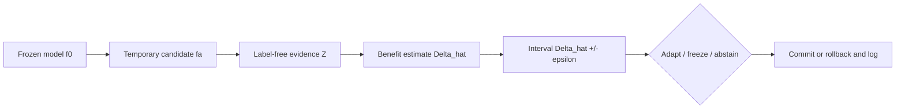

# K-Bound Theory-to-Code Map

This map connects the claim-controlled short paper to the maintained Python
implementation, Lean declarations, and promoted empirical artifacts. It also
states where the connection is conditional or paper-only.

## Two Distinct Layers

| Quantity | Layer | Role | Implemented on real benchmarks? |
|---|---|---|---|
| `M` | population theory | observable evidence margin | no |
| `gamma` | population theory | latent calibration drift | no |
| `beta` | population theory | declared drift budget | no |
| `Delta_hat` | empirical KGA | estimated adaptation benefit | yes |
| `epsilon` | empirical KGA | calibrated residual radius | yes |

The population frontier and empirical certificate are related but are not the
same calculation. Real-data KGA estimates `Delta` directly and does not
numerically receive `M`, `gamma`, or `beta`.

## Core Result Map

| Paper result | Paper source | Lean coverage | Runtime connection | Scope boundary |
|---|---|---|---|---|
| Disagreement-region reduction (`lem:reduction`) | `paper/sections/theory_core_main.tex` | `KBound/Disagreement.lean` | benefit convention in `kga/certificate.py` | assumes the declared loss and predictor pair |
| Interior matched-evidence impossibility (`lem:nonid`) | `paper/sections/theory_core_main.tex` | supporting finite obstruction in `KBound/Impossibility.lean` and `KBound/LeCam.lean` | motivates abstention; not numerically evaluated by KGA | full target-law construction remains paper-level |
| Closed-band abstention (`prop:closed-band`) | `paper/sections/theory_core_main.tex` | supporting decision lemmas in `KBound/Gate.lean` and `KBound/Frontier.lean` | three-way rule in `kga/policy.py` | equality is zero-versus-strict ambiguity, not opposite nonzero signs |
| Strict-commitment frontier (`thm:frontier`) | `paper/sections/theory_core_main.tex` | algebraic sufficiency in `KBound/Frontier.lean` | conceptual only on real data | necessity uses the paper's declared-class richness assumption |
| Interval certificate (`thm:certificate`) | `paper/sections/theory_core_main.tex` | deterministic and measure-level implications in `KBound/Certificate.lean` and `KBound/Probability/MeasureCertificate.lean` | exact-rank radius in `kga/certificate.py`; edge radius in `edge/src/kbound_edge/conformal.py` | coverage is a premise; exchangeability or correction supports coverage |
| Multiclass bridge (`prop:multiclass`) | `kbound_short.tex` | sign and harm reductions in `KBound/Corollaries.lean` | KGA still estimates `Delta` directly | does not use the binary identity `p0 = 1 - pa` |

The complete Lean declaration inventory is
[`formal/KBound/TheoremMap.lean`](formal/KBound/TheoremMap.lean). A successful
strict-core build does not establish risk alignment, calibration transfer, the
full target-law necessity construction, or all foundational probability layers.

## Certificate-to-Deployment Path



| Step | Maintained code | Integrity test |
|---|---|---|
| Exact split-conformal rank | `kga/certificate.py` | `tests/test_kga_package.py` |
| Three-way routing | `kga/policy.py`, `kga/routing.py` | `tests/test_kga_routing.py` |
| Edge evidence and benefit fit | `edge/src/kbound_edge/evidence.py`, `benefit_estimator.py` | `edge/tests/test_features.py`, `test_real_calibration.py` |
| Candidate isolation and rollback | `edge/src/kbound_edge/tent_adapter.py`, `replay.py` | `edge/tests/test_candidate_isolation.py` |
| No-live-label contract | `edge/src/kbound_edge/logging.py`, `integrity.py` | `edge/tests/test_no_live_labels.py`, `test_real_integrity.py` |
| Publication decision | `edge/src/kbound_edge/publication.py` | `edge/tests/test_publication_gate.py` |

Abstention applies to the update. Prediction continues with the frozen fallback.

## Empirical Claim Map

All promoted numbers enter the paper and dashboard through
`paper/generated/kbound_result_manifest.json`.

| Evidence class | Promoted result | Source indexed by the manifest | Defensible conclusion |
|---|---|---|---|
| Controlled mixed | CIFAR-10-C Tent/EATA, five seeds | `stress_grid_multiseed_v1/LOCKED_ANALYSIS_RESULTS.json` | archived CI beats-both under cross-fitted empirical residual calibration |
| Controlled mixed | ImageNet-C SAR, 27 cells, seed 0 | `win_hunt_v5/imagenetc_aggr/percondition_bootstrap.json` | paired-bootstrap beats-both with a single-seed caveat |
| Natural shifts | Office-Home and iWildCam | `research_lock/KBOUND_WIN_BOOTSTRAP_CIS_oof.json` | no-harm, not a clean natural beats-both claim |
| Natural shifts | Camelyon17 | `audits/.../camelyon_reconciliation/` | genuine OOD no-harm after protocol reconciliation |
| Natural shifts | RxRx1 | locked manifest summary | no-harm |
| Constructed routing | three-source OOF stream | `mixed_protocol_oof_v2_result.json` | routing value on a researcher-constructed aggregate |
| Diagnostic/incomplete | CIFAR-10.1, ImageNet-R, PACS | manifest status records | no structural unknowability claim |

## Verification

```bash
make verify-fast
make paper
make formal
```

`make formal` may compile Mathlib from source on the first run. The physical
study has a separate fail-closed gate; see `edge/PHYSICAL_STUDY_RUNBOOK.md`.
